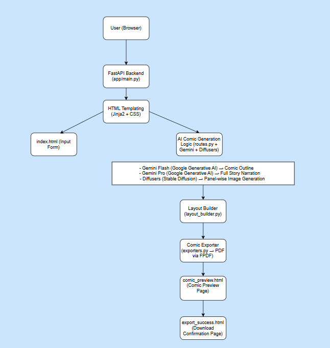

# ComicCraft

ComicCraft is an AI-assisted comic generator. Give it a story idea, character,
setting, tone, and art style; it creates a five-panel outline, writes panel
narration and captions, generates an image for each panel, and exports the
finished comic as a multi-page PDF.

## Team

- **Team ID:** SWTID-2026-8368
- **Team Leader:** Nivriti Muthu Vairavan
- **Team Members:** Fathima Fahmiya S, Mounika K M, Tharun P, and Yuvaraj B

## Features

- Five-panel story outlines generated with Google Gemini Flash.
- Captions and narration expanded with Google Gemini Pro.
- Comic panel images generated locally with Stable Diffusion 1.5 using
  Hugging Face Diffusers and PyTorch.
- Browser-based form and comic preview.
- PDF export with embedded DejaVu fonts.
- JSON generation endpoint and a single-image test endpoint.

## How it works

1. The browser submits the story prompt and creative choices to the FastAPI app.
2. Gemini Flash returns a five-panel outline.
3. Gemini Pro writes captions and narration for the outline while the app
   generates the panel images.
4. The app combines the text and images into a comic layout and saves a PDF.
5. The preview page displays the panels and links to the PDF.

The first app startup loads the Stable Diffusion model in the background.
On first use, Diffusers downloads the model files from Hugging Face; this can
take several minutes and requires substantial disk space and memory. Image
generation speed depends on the available hardware. The application selects
CUDA when available, Apple MPS on supported Macs, and CPU otherwise.

## Architecture

The diagram below is the architecture diagram from the project specification.



## Requirements

- Python 3.10 or newer with versions compatible with the packages in
  `requirements.txt` (Python 3.10–3.12 is a practical starting point).
- A Google Gemini API key for comic generation.
- Internet access on first startup/use to download the Stable Diffusion model
  and to call Gemini.
- Sufficient disk space for the downloaded model and generated images/PDFs.
  A supported GPU is recommended; CPU generation may be very slow.

`HF_API_KEY` is included in `.env.example` for convenience, but the current
code does not read it. The configured Stable Diffusion model is public, so it
is not required for this implementation.

## Run locally

Run these commands from the project root.

### Windows PowerShell

```powershell
py -3 -m venv .venv
.\.venv\Scripts\Activate.ps1
python -m pip install --upgrade pip
pip install -r requirements.txt
Copy-Item .env.example .env
notepad .env
python -m uvicorn app.main:app --reload
```

If PowerShell blocks virtual-environment activation, either allow scripts for
the current PowerShell process and activate again:

```powershell
Set-ExecutionPolicy -Scope Process -ExecutionPolicy RemoteSigned
```

Alternatively, use the environment's interpreter directly:
`.venv\Scripts\python.exe -m uvicorn app.main:app --reload`.

### macOS / Linux

```bash
python3 -m venv .venv
source .venv/bin/activate
python -m pip install --upgrade pip
pip install -r requirements.txt
cp .env.example .env
# Edit .env and set GEMINI_API_KEY.
python -m uvicorn app.main:app --reload
```

### Configure API keys

Edit the newly created `.env` file and set your Gemini API key:

```dotenv
GEMINI_API_KEY=replace_with_your_gemini_api_key
```

Get a key from [Google AI Studio](https://aistudio.google.com/app/apikey).
Keep the real key private: `.env` must not be committed or shared. `.env.example`
contains placeholders and is safe to commit. The model names can optionally be
overridden with `GEMINI_FLASH_MODEL` and `GEMINI_PRO_MODEL`; otherwise the
application defaults to `models/gemini-1.5-flash` and `models/gemini-1.5-pro`.

Once Uvicorn is running, open <http://127.0.0.1:8000>. Keep the terminal open
while using the app. Stop the server with `Ctrl+C`.

## API endpoints

| Method | Path | Purpose |
| --- | --- | --- |
| `GET` | `/` | Open the web form. |
| `POST` | `/generate` | Submit the form and render the comic preview. |
| `POST` | `/generate-comic/json` | Generate a comic from a JSON request. |
| `GET` | `/test-image?prompt=...` | Generate one test image without calling Gemini. |
| `GET` | `/export-success?pdf=...` | Render the export confirmation page. |
| `GET` | `/docs` | Explore the FastAPI/OpenAPI interface. |

The JSON endpoint expects `prompt`, `character`, `setting`, `tone`, and `style`,
all as strings. Example:

```json
{
  "prompt": "A brave fox explores an enchanted forest",
  "character": "Rio",
  "setting": "forest",
  "tone": "light-hearted",
  "style": "anime"
}
```

The JSON response contains `layout` (the generated panel data) and `pdf_path`
(a URL under `/static/exports/`).

## Project structure

```text
app/
  main.py             FastAPI application setup and static-file mount
  routes.py           Web and JSON routes; orchestrates comic generation
  gemini_flash.py     Five-panel outline generation
  gemini_pro.py       Captions and narration generation
  image_generator.py  Local Stable Diffusion image generation
  layout_builder.py   Combines outline, story, and images into panels
  exporters.py        Writes the multi-page PDF
templates/
  index.html          Comic creation form
  comic_preview.html  Generated comic preview and download link
  export_success.html Export confirmation
static/
  bg.jpg              Landing-page background
  fonts/              DejaVu fonts and their license for PDF output
  panels/             Runtime-generated panel images (not source assets)
  exports/            Runtime-generated PDF files (not source assets)
docs/                 Project-phase and demonstration documents
requirements.txt      Python dependencies
.env.example          Placeholder environment configuration
```

## Troubleshooting

- **Missing `GEMINI_API_KEY`:** confirm `.env` exists in the project root and
  contains a valid key. The app loads this file at startup; restart Uvicorn
  after changing it.
- **Gemini/API errors:** check the key, network connectivity, account access,
  and the configured model names. The Gemini API may have quotas or billing
  requirements.
- **Slow startup or generation:** Stable Diffusion model loading and image
  generation can take several minutes, especially on CPU. Allow the initial
  model download to complete.
- **Memory or disk errors:** the model requires significant resources. Free
  disk space, close other memory-heavy applications, or use a machine with a
  supported GPU.
- **Missing images in the preview:** keep `static/panels/` writable; generated
  images are saved there while the application runs.

## Project documentation

The `docs/` directory contains the project's brainstorming, requirements,
design, planning, development, testing, documentation, and demonstration
deliverables. See [docs/README.md](docs/README.md) for the document index.
